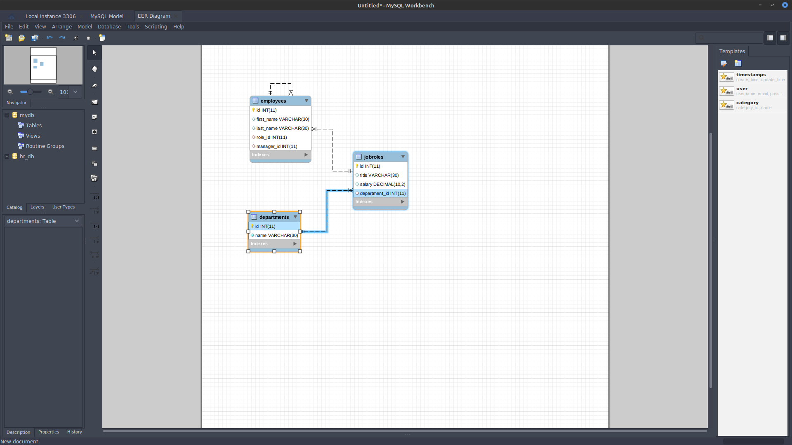

  # Project Title: Employee Tracker 
  ### 
  
  ## Table of contents:
  1. [Title](#Project-Title)
  1. [License](#License)
  1. [Project Description](#Project-Description)
  1. [Installation](#Installation-Instructions)
  1. [Useage](#How-To-Use)
  1. [How to Contribute](#How-to-Contribute)
  1. [Test Instructions](#Test-Instructions)
  1. [Questions](#Questions)

  ## License: 
  ### This project is licensed under MIT (click on icon near the top):
  or here: [MIT](https://opensource.org/licenses/MIT)
 

  ## Project Description:
  Database and CLI program for a database to keep track of employees, it has a mySql database with a scheme that looks like this:
  
  

  ## Installation Instructions:
  fork it on github
  ## How To Use
  It is a CLI app running in node. Run it from root dir using node app.js
  ## How to Contribute:
  * Comment and bugfix - please
  * Checkout the github repo and please raise any issues with Employee Tracker you come across 
  * Even better - help with bugfixes and features by submitting your solutions in pull requrets for the repo
  * Follow the code of coduct for contribution outlined in [Contributor Covenant](https://www.contributor-covenant.org/) 
  ## Test Instructions
  ### The testing strategy is as follows
  #### Not implemented, use Trial and Error

  ## Questions
  Feel free to reach out either in the projects GitHub page or send an email to the address below
  ### Github page:
  [GitHub](https://github.com/KJWesthoff/EmployeeTracker)
  ### email:
  [karl.johan.westhoff@gmail.com](mailto:karl.johan.westhoff@gmail.com) 
